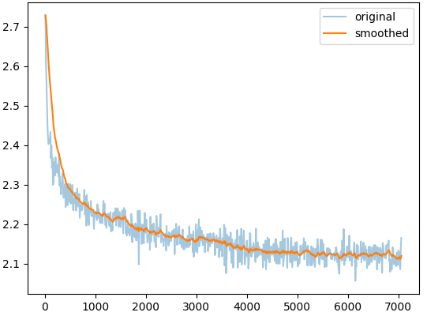
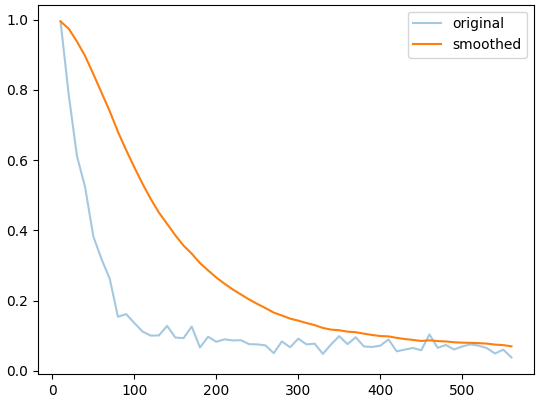
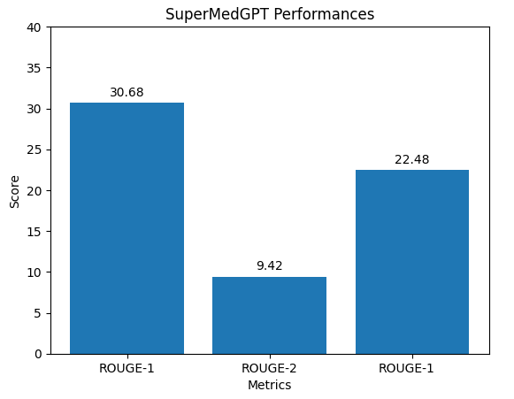
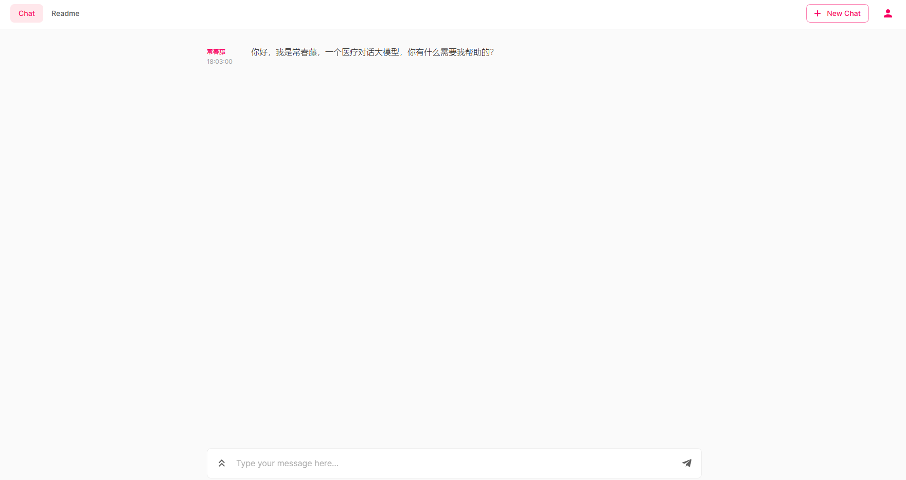
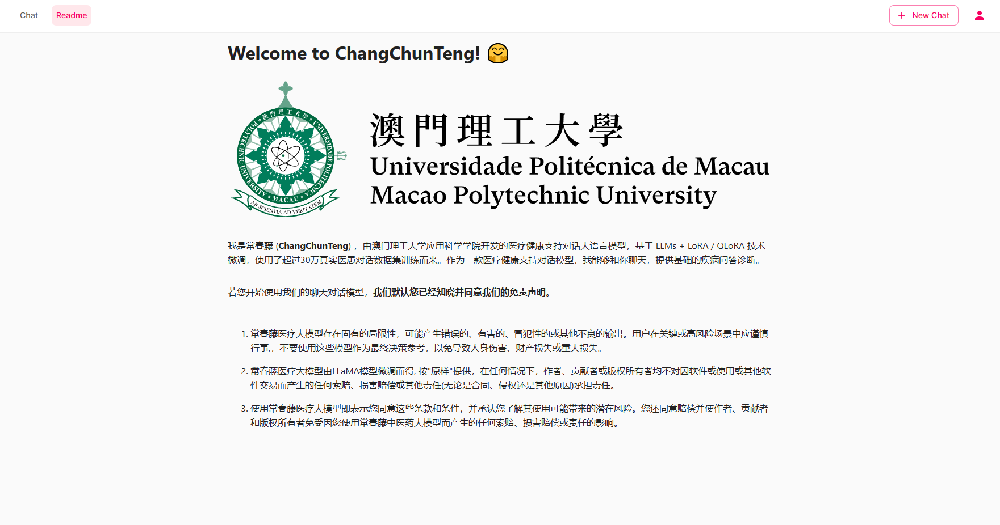
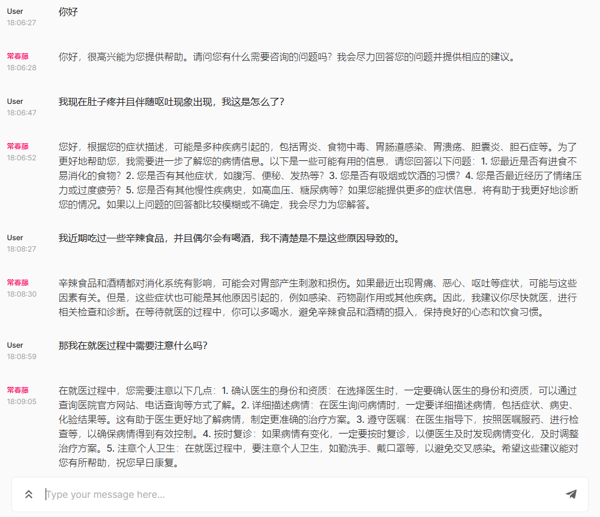

# lvyGPT 💊 产生最贴近真实医生问诊效果的医疗大语言模型

近期在通用领域中出现的大语言模型（LLMs），例如ChatGPT，在遵循指令和产生类人响应方面表现出了显著的成功。然而，这样的大型语言模型并没有被广泛应用于医学领域，导致响应的准确性较差，无法提供关于医学诊断、药物等合理的建议。为了应对这一挑战，我们提出了lvyGPT，这是一个医疗大语言模型，它在高质量的医学问答数据上进行了监督微调，并使用人类反馈的强化学习进行了训练。该项目的特性包括：

1. 🍦支持在医疗问答LLM上全流程训练：监督训练、奖励模型、强化学习 (RLHF)；
2. 🏵️多微调方法支持：LoRA、QLoRA等；
3. 🥄高效智能的数据集制作工具：奖励模型训练数据集生成工具-Rank Dataset Generator、监督训练数据集生成工具-Instruction Dataset Generator；
4. 🧽超30万高质量医患对话数据集用于支持训练；

在这里我们不仅关注lvyGPT项目本身，我们还深入到开源社区中，持续的关注各位开发者关于医疗LLM的开发动态，我们对许多的工作表示惊叹。如：
- **英文**医疗LLM领域：[ChatDoctor](https://github.com/Kent0n-Li/ChatDoctor)、[PMC-LLaMA](https://github.com/chaoyi-wu/PMC-LLaMA)、[medAlpaca](https://github.com/kbressem/medAlpaca)；
- **中文**医疗LLM领域：[ChatMed](https://github.com/michael-wzhu/ChatMed)、[Med-ChatGLM](https://github.com/SCIR-HI/Med-ChatGLM)、[Huatuo-Llama-Med-Chinese](https://github.com/SCIR-HI/Huatuo-Llama-Med-Chinese)、[DoctorGLM](https://github.com/xionghonglin/DoctorGLM)、[MedicalGPT-zh](https://github.com/MediaBrain-SJTU/MedicalGPT-zh)、[QiZhenGPT](https://github.com/CMKRG/QiZhenGPT)、[BianQue](https://github.com/scutcyr/BianQue)、[MedicalGPT](https://github.com/shibing624/MedicalGPT)、[LLM-Pretrain-FineTune](https://github.com/X-jun-0130/LLM-Pretrain-FineTune)；

关于常春藤 (lvyGPT) ：

1. 常春藤是一种常见的攀援植物，其拉丁学名为Hedera helix。常春藤的叶子呈现出深绿色，具有闪亮的光泽，常被用作装饰植物。此外，常春藤在医学领域也有其应用，其叶子中含有一些活性成分，可以用于治疗一些疾病。例如，常春藤可以用于治疗呼吸道疾病、消化系统疾病、皮肤病等。此外，常春藤还具有镇静、镇痛、抗炎等作用，可以用于缓解焦虑、失眠、疼痛等症状。
2. 常春藤是一种常绿的攀援植物，它的寓意在医学上也很美好。常春藤的攀爬和延伸象征着医学的不断发展和进步，它的常绿象征着医学的持久不变和永恒的价值。此外，常春藤还有着坚韧、适应力强等特点，这也是医学工作者所需要具备的品质。因此，常春藤在医学上被赋予了积极向上的寓意，它象征着医学工作者不断追求进步和创新的精神。
3. 常春藤在医院患者身上也有着美好的寓意。常春藤的攀爬和延伸象征着患者的希望和努力，他们在疾病的折磨下仍然坚强地向前迈进，不断寻求治疗和康复的方法。常春藤的常绿象征着患者们的生命力和坚韧不拔，他们在面对疾病时不会轻易放弃，而是坚持不懈地与疾病作斗争。因此，常春藤在医院患者身上也被赋予了积极向上的寓意，它象征着患者们对生命的热爱和追求，以及对未来的信心和希望。

# 工作一览

## 训练

<details>
  <summary>实验环境</summary>
    
*四卡A100 80GB, 数据30万, 全流程采用LoRA方法。

</details>

|指标\阶段|监督微调|奖励模型|强化学习|
|:-|:-|:-|:-|
|Loss||||
|Time|4.5小时|40分钟|33小时|

## 评估

<details>
  <summary>关于Rouge</summary>
    
*Rouge(Recall-Oriented Understudy for Gisting Evaluation)，是评估自动文摘以及机器翻译的一组指标。它通过将自动生成的摘要或翻译与一组参考摘要（通常是人工生成的）进行比较计算，得出相应的分值，以衡量自动生成的摘要或翻译与参考摘要之间的“相似度”。

</details>



## 部署

- 主界面


- 说明界面


- 多轮对话


- 对话清除


# 项目参与

这项工作由澳门理工大学应用科学学院硕士生王荣胜完成，指导老师为檀韬副教授。

# 免责声明

本项目相关资源仅供学术研究之用，严禁用于商业用途。使用涉及第三方代码的部分时，请严格遵循相应的开源协议。模型生成的内容受模型计算、随机性和量化精度损失等因素影响，本项目无法对其准确性作出保证。即使本项目模型输出符合医学事实，也不能被用作实际医学诊断的依据。对于模型输出的任何内容，本项目不承担任何法律责任，亦不对因使用相关资源和输出结果而可能产生的任何损失承担责任。

# 引用

如果您觉得此项目有帮助，请引用：

```bibtex
@Misc{lvyGPT,
  title = {lvyGPT},
  author = {wangrongsheng, Tao Tan},
  howpublished = {\url{https://github.com/wangrongsheng/lvyGPT}},
  year = {2023}
}
```
